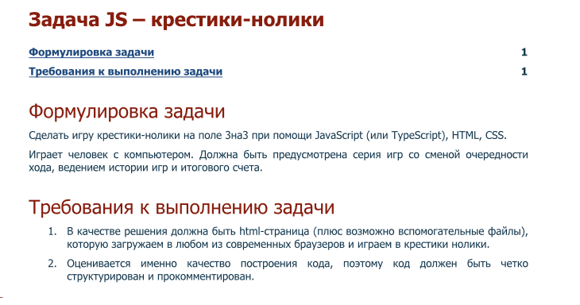

Тестовое задание от Tensor UFA

Сделать игру крестики-нолики на поле 3на3 при помощи JavaScript (или TypeScript), HTML, CSS.
Играет человек с компьютером. Должна быть предусмотрена серия игр со сменой очередности
хода, ведением истории игр и итогового счета.

Demo: https://osdnyasha.github.io/tic_tac_toe/
